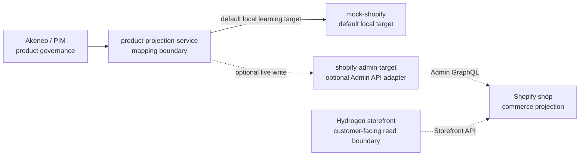

# Hydrogen Storefront

Source basis: official Shopify Hydrogen, headless, and Storefront API documentation listed in [Shopify Sources](../../sources/external/shopify/README.md).

This page records the project interpretation for introducing Hydrogen into MVP v0.1. It does not replace official Shopify documentation.

## Intent

Hydrogen is the optional customer-facing storefront boundary for the lab. It consumes the Shopify commerce projection; it does not govern product data and does not write product projections.

The architecture path is:



## Boundary Rules

Hydrogen owns:

- Storefront routes and presentation.
- Customer-facing product, collection, cart, and content read experiences after official-doc verification.
- Storefront API query composition for customer-facing reads.
- Storefront environment configuration needed by the Hydrogen app.

Hydrogen does not own:

- PIM product governance.
- Product projection mapping.
- Shopify Admin GraphQL writes.
- Admin tokens or product deletion policy.
- n8n orchestration.
- Fulfillment integration.

## MVP Position

Hydrogen is now allowed in MVP v0.1 because it was explicitly requested and recorded in [ADR-007](../decisions/ADR-007-hydrogen-storefront-boundary.md).

The optional scaffold lives under `apps/storefront`. It is not part of the default Docker Compose stack. The default local projection path remains `mock-shopify`; live Shopify remains opt-in through [Shopify Live Sync](shopify-live-sync.md).

Current scaffold scope:

- Product, collection, page, blog, policy, search, robots, sitemap, and cart routes from the Hydrogen scaffold.
- Product detail add-to-cart behavior and cart line add/update/remove behavior.
- A demo rug-shop presentation branded as Context Home, backed by generated demo images and Shopify Storefront API product reads.
- No checkout redirect route.
- No Customer Account API routes or customer profile/order/address mutations.
- No Shopify Admin API calls from Hydrogen.

Run locally:

```sh
npm run storefront:dev
```

Build locally:

```sh
npm run storefront:build
```

Check Hydrogen starter agent rules copied from the Shopify CLI scaffold:

```sh
npm run storefront:check-agent-rules
npm run storefront:sync-agent-rules
```

The tracked rules live under `apps/storefront/.cursor/rules/`. They are Cursor-compatible advisory hints that this repository also asks agents to read when working under `apps/storefront`. The check script compares those tracked rules with the installed Shopify CLI Hydrogen starter template and reports newly added or changed upstream rules. The sync script copies missing upstream rules only; changed local rules still require review unless the operator explicitly uses the script's `--force` option.

Sync the optional live Shopify development shop with the Context Home demo catalog:

```sh
SHOPIFY_DEMO_DRY_RUN=true npm run shopify:sync-akeneo-demo-catalog
npm run shopify:sync-akeneo-demo-catalog
```

The sync command is an explicit local operator action. By default it reads [Akeneo export data](../../examples/products/akeneo-context-home-catalog.json); with `SHOPIFY_DEMO_AKENEO_SOURCE=api`, it reads the same demo identifiers from a running local Akeneo REST API. It then passes each product through the repository product projection mapping, uses the existing private `.env` / `.env.agent` Shopify Admin auth pattern, creates or updates four demo rug products, uploads generated demo media, sets inventory, publishes the products to every Shopify publication matched by the configured publication pattern, and exposes simple `details.*` product metafields to the Storefront API. It keeps Admin API writes outside Hydrogen; the storefront continues to read through Storefront API patterns.

## Environment And Secrets

Hydrogen storefront environment variables must stay in private environment configuration. Do not commit real storefront tokens, customer account values, Oxygen deployment secrets, screenshots with tokens, or generated Shopify CLI environment files.

The repository may document blank placeholders in `.env.example`, but real values belong only in a private `.env` file or a real secret manager.

The storefront has its own ignored local file at `apps/storefront/.env`. The public placeholder shape is `apps/storefront/.env.example`.

Connecting to the real Shopify shop requires a Storefront API token or a linked Hydrogen storefront environment. The local Shopify CLI `store auth` flow accepts Shopify access scopes, but Storefront API token creation depends on unauthenticated Storefront scopes such as product listings, product inventory, content, and checkout/cart access. A non-existent scope like `write_storefront_access_tokens` is invalid.

For this project, the preferred path is to create or link a storefront through Shopify's Headless/Hydrogen channel, copy or pull the Storefront API environment values into the ignored `apps/storefront/.env`, and then publish approved products to the appropriate storefront sales channel. The local operator command `npm run shopify:publish-sample` can also write a generated Storefront token to `apps/storefront/.env` when run with `SHOPIFY_CREATE_STOREFRONT_TOKEN=true` after the required unauthenticated scopes are granted. Until then, the scaffold can run against Mock.shop.

The Shopify Hydrogen sales channel must be installed on the target shop before `shopify hydrogen link` can connect the local app to a real Hydrogen storefront. If the sales channel is not installed, local Hydrogen will continue to fall back to Mock.shop unless `apps/storefront/.env` is populated through another approved Storefront API token path.

The Context Home demo catalog uses generated local images under `apps/storefront/public/demo-catalog/` as upload sources for Shopify media and keeps one generic product placeholder for missing Storefront media. Product names, prices, descriptions, attributes, and product-specific media come from Akeneo-shaped export data or Akeneo REST products projected into Shopify, not from static Hydrogen product data. Real storefront tokens, generated Shopify CLI environment files, and shop credentials remain ignored and must not be committed.

## Review Gates

Hydrogen changes require storefront review when they affect:

- Storefront API queries or assumptions.
- Product, collection, cart, or content presentation.
- Sales channel publication behavior.
- Environment variable requirements.
- Deployment topology.

Checkout, Customer Account API, customer identity, customer data, analytics attribution, or order-affecting behavior require the customer data and checkout review gates before implementation.

## Non-Goals

- No production Hydrogen or Oxygen deployment in MVP v0.1.
- No Customer Account API implementation until separately reviewed.
- No checkout customization until separately reviewed.
- No Storefront API claims without official Shopify documentation.
- No Shopify Admin API calls from Hydrogen.
