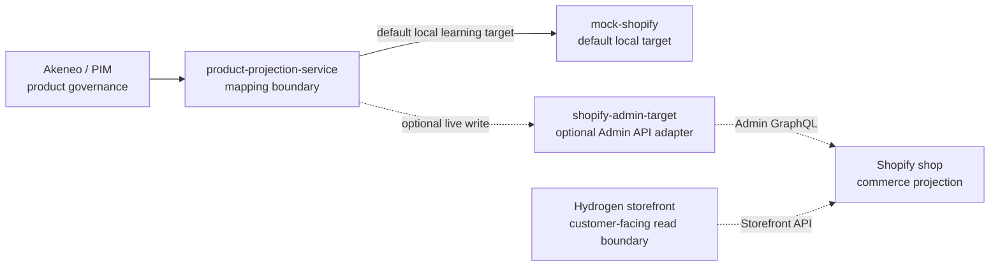

# Hydrogen Storefront

Source basis: official Shopify Hydrogen, headless, and Storefront API documentation listed in [Shopify Sources](../../sources/external/shopify/README.md).

This page records the project interpretation for introducing Hydrogen into MVP v0.1. It does not replace official Shopify documentation.

## Intent

Hydrogen is the optional customer-facing storefront boundary for the lab. It consumes the Shopify commerce projection; it does not govern product data and does not write product projections.

The architecture path is:

## Boundary Rules

Hydrogen owns:

- Storefront routes and presentation.
- Customer-facing product, collection, cart, and content read experiences after official-doc verification.
- Storefront API query composition for customer-facing reads.
- Storefront environment configuration needed by the Hydrogen app.

Hydrogen does not own:

- PIM product governance.
- Product projection mapping.
- Shopify Admin GraphQL writes.
- Admin tokens or product deletion policy.
- n8n orchestration.
- Fulfillment integration.

## MVP Position

Hydrogen is now allowed in MVP v0.1 because it was explicitly requested and recorded in [ADR-007](../decisions/ADR-007-hydrogen-storefront-boundary.md).

It remains optional and not part of the default Docker Compose stack until a separate implementation step adds a storefront scaffold. The default local projection path remains `mock-shopify`; live Shopify remains opt-in through [Shopify Live Sync](shopify-live-sync.md).

## Environment And Secrets

Hydrogen storefront environment variables must stay in private environment configuration. Do not commit real storefront tokens, customer account values, Oxygen deployment secrets, screenshots with tokens, or generated Shopify CLI environment files.

The repository may document blank placeholders in `.env.example`, but real values belong only in a private `.env` file or a real secret manager.

## Review Gates

Hydrogen changes require storefront review when they affect:

- Storefront API queries or assumptions.
- Product, collection, cart, or content presentation.
- Sales channel publication behavior.
- Environment variable requirements.
- Deployment topology.

Checkout, Customer Account API, customer identity, customer data, analytics attribution, or order-affecting behavior require the customer data and checkout review gates before implementation.

## Non-Goals

- No production Hydrogen or Oxygen deployment in MVP v0.1.
- No Customer Account API implementation until separately reviewed.
- No checkout customization until separately reviewed.
- No Storefront API claims without official Shopify documentation.
- No Shopify Admin API calls from Hydrogen.
