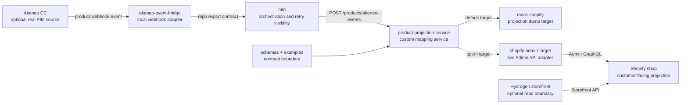

# Product Export Flow

This page specifies the product export and projection flow for optional local Akeneo CE and optional Shopify live sync. The durable decisions are [ADR-005](../decisions/ADR-005-product-export-projection-flow.md), [ADR-006](../decisions/ADR-006-shopify-live-target-adapter.md), and [ADR-007](../decisions/ADR-007-hydrogen-storefront-boundary.md).

## Intent

Move governed rug product data from Akeneo/PIM toward a Shopify-compatible projection through explicit contracts.

The default implementation target is a [mock Shopify projection dump](mock-shopify-target.md). Optional live Shopify sync is documented in [Shopify Live Sync](shopify-live-sync.md). Optional Hydrogen storefront consumption is documented in [Hydrogen Storefront](hydrogen-storefront.md).

Akeneo CE is used locally as a real PIM interface, but this repository does not assume official Event Platform support for Community Edition. The local MVP uses Akeneo's local webhook/event subscription mechanics plus `akeneo-event-bridge` to adapt product events into the repo-owned export contract. A future Akeneo Event Platform adapter remains a separate boundary.

## Boundary Model



## Responsibilities

Akeneo/PIM owns:

- Product family.
- Product attributes.
- Product completeness and enrichment state.
- Canonical product vocabulary.

n8n owns:

- Receiving normalized Akeneo product export events from the bridge.
- Queue-like workflow visibility for local MVP.
- Calling the projection service.
- Routing success, retryable failure, and review-required failure paths.

The product projection service owns:

- Runtime validation.
- Mapping Akeneo export payloads to the local PIM product contract.
- Mapping governed PIM products to Shopify projection contracts.
- Idempotency keys.
- Audit event shape.
- Projection failure classification.

The Context Home demo catalog is represented as Akeneo export data in [akeneo-context-home-catalog.json](../../examples/products/akeneo-context-home-catalog.json). The local Shopify storefront sync command can use that export data as the offline source, or read the same seeded identifiers from local Akeneo REST with `SHOPIFY_DEMO_AKENEO_SOURCE=api`. It projects the Akeneo product data through the product mapping and then performs explicit dev-shop media, inventory, and publication operations needed for the customer-facing Hydrogen demo.

The Akeneo event bridge owns:

- Receiving Akeneo webhook envelopes.
- Ignoring non-rug product events for this lab scope.
- Normalizing rug product events to [akeneo-product-export.schema.json](../../schemas/akeneo-product-export.schema.json).
- Forwarding normalized events to the active n8n product projection webhook.

The mock Shopify projection target owns:

- Receiving projected product payloads.
- Storing or dumping the projection for inspection.
- Returning deterministic local responses.

The Shopify Admin target owns:

- Receiving projected product payloads and removal commands.
- Calling Shopify Admin GraphQL with credentials from private environment variables.
- Upserting projected products using the PIM product ID as the cross-system identifier.
- Archiving removed Akeneo products by default.
- Permanently deleting products only when explicitly configured.

Real Shopify owns:

- Customer-facing commerce projection after official-doc verification and intentional credential setup.

Hydrogen owns:

- Optional customer-facing storefront reads through Storefront API patterns.
- Storefront presentation and routing after official-doc verification.
- Private storefront environment values outside source control.

## MVP Product Flow

1. Akeneo CE is installed through the optional local setup described in [Akeneo Local Setup](akeneo-local-setup.md).
2. Rug family, rug attributes, and sample rug products are created in Akeneo.
3. Akeneo product changes produce local webhook events.
4. `akeneo-event-bridge` normalizes rug product events to the repo export contract.
5. n8n receives the normalized payload and calls `product-projection-service`.
6. The projection service validates and maps the product.
7. The projection service sends a Shopify projection payload to the configured target.
8. The mock target stores a dump, or the Shopify Admin target writes to the configured shop.
9. Failures are classified as validation, mapping, target, or review-required failures.

## Product Removal Flow

1. Akeneo emits a product removal event.
2. `akeneo-event-bridge` normalizes the event to a removal-shaped export contract.
3. n8n forwards the normalized event to `product-projection-service`.
4. The projection service builds a removal command using the PIM product identity.
5. The mock target removes the local dump, or the Shopify Admin target archives the Shopify product by default.
6. Permanent deletion is available only through explicit `SHOPIFY_DELETE_MODE=permanent` configuration.

## Failure Classes

- `AKENEO_EXPORT_INVALID`: export payload cannot be validated.
- `PIM_PRODUCT_INCOMPLETE`: product is not ready for commerce projection.
- `PROJECTION_MAPPING_MISSING`: required mapping or target field decision is missing.
- `SHOPIFY_DOCS_VERIFICATION_REQUIRED`: implementation needs current official Shopify behavior.
- `TARGET_UNAVAILABLE`: projection target cannot be reached.

## Review Gate

Product export and projection changes require product projection review because they affect product governance and customer-facing commerce behavior.

## Local Run Command

Use:

```sh
npm run akeneo:demo-up
```

This starts the optional local Akeneo flow, activates the product n8n workflow, configures Akeneo's local webhook target, starts the Akeneo webhook worker, and seeds/updates the rug product. The resulting projection is written under `.local/mock-shopify-dumps/`.

## Non-Goals

- No Shopify credentials in the repository.
- No production Shopify app lifecycle.
- No Shopify metaobject definition lifecycle yet.
- No production Hydrogen or Oxygen deployment.
- No production queue or cloud deployment.
- No claim that Akeneo CE supports the official Akeneo Event Platform.
