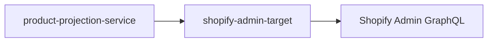

# Shopify Admin Agent Access

Source basis: official Shopify Admin GraphQL documentation listed in [Shopify Sources](../../sources/external/shopify/README.md).

This page governs repo-local agent/operator access to Shopify Admin GraphQL. It is not the live product projection runtime path.

## Intent

The optional Shopify Admin MCP helper under `mcp/shopify-admin/` lets an operator or agent inspect a configured Shopify development/basic shop and run explicitly requested Admin GraphQL operations.

It exists for bounded architecture and setup work, not for background sync, autonomous writes, or bypassing product projection review.

## Boundary Rules

Agent/operator Admin access owns:

- Connection checks against the configured shop.
- Small read-only inspection queries.
- Explicitly requested Admin GraphQL operations during reviewed setup or debugging.

Agent/operator Admin access does not own:

- Product projection mapping.
- Routine product sync.
- Akeneo-to-Shopify orchestration.
- Product deletion policy.
- Storefront API or Hydrogen behavior.
- Customer data or checkout behavior.

The MVP runtime write path remains:



## Credentials

Runtime sync uses private `.env` values such as `SHOPIFY_ADMIN_ACCESS_TOKEN`.

Agent/operator access uses ignored `.env.agent` values such as `SHOPIFY_AGENT_ADMIN_ACCESS_TOKEN`.

Do not commit real Admin API tokens, generated credential files, Shopify CLI auth files, screenshots containing credentials, or copied GraphQL responses that expose secrets.

## Review Gate

Read-only inspection still requires a clear task purpose. Writes, deletes, publication changes, metafield definition changes, metaobject lifecycle changes, or any mutation affecting product projection require product projection review and explicit user direction.

Permanent deletion remains out of normal scope. Use archive-first behavior unless a disposable development data deletion has been explicitly reviewed.

## Local Commands

The local connection check is:

```sh
npm run shopify:agent-check
```

The MCP server command is:

```sh
npm run mcp:shopify-admin
```
