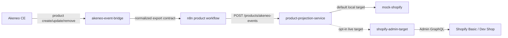

# Shopify Live Sync

This page describes the optional live Shopify target for the Akeneo product projection flow.

Live Shopify sync is a development-store projection target. It does not make Shopify the product master.

Hydrogen storefront work, governed by [Hydrogen Storefront](hydrogen-storefront.md) and [ADR-007](../decisions/ADR-007-hydrogen-storefront-boundary.md), consumes the Shopify projection through Storefront API patterns. It must not bypass this adapter for Admin API product writes.

Repo-local operator access to Shopify Admin GraphQL is governed separately by [Shopify Admin Agent Access](shopify-admin-agent-access.md). It is not the runtime sync path and must not become autonomous product projection.

## Runtime Path



## Target Modes

Default local mode:

- `PRODUCT_PROJECTION_TARGET=mock-shopify`
- `PRODUCT_TARGET_URL=http://mock-shopify:8087`

Live Shopify mode:

- `PRODUCT_PROJECTION_TARGET=shopify-dev-store`
- `PRODUCT_TARGET_URL=http://shopify-admin-target:8088`
- Compose profile: `shopify-live`

Local adapter auth modes:

- `SHOPIFY_ADMIN_AUTH_MODE=token`: default runtime mode using `SHOPIFY_ADMIN_ACCESS_TOKEN`.
- `SHOPIFY_ADMIN_AUTH_MODE=cli`: local development mode using a prior `shopify store auth` session on the developer machine. Use this only for local operator-approved smoke tests; do not treat CLI login as production runtime credentials.

## Shopify Credentials

Put real values only in a private `.env` file:

```sh
SHOPIFY_SHOP_DOMAIN=your-shop.myshopify.com
SHOPIFY_ADMIN_AUTH_MODE=token
SHOPIFY_ADMIN_ACCESS_TOKEN=<private-shopify-admin-token>
SHOPIFY_API_VERSION=2026-04
SHOPIFY_DELETE_MODE=archive
```

Do not commit credentials, generated tokens, screenshots containing tokens, or n8n credential exports.

## Agent / Architect Access

Agent or operator Shopify access is separate from runtime sync credentials.

Use [Shopify Admin Agent Access](shopify-admin-agent-access.md) with ignored `.env.agent`:

```sh
SHOPIFY_AGENT_SHOP_DOMAIN=your-shop.myshopify.com
SHOPIFY_AGENT_ADMIN_ACCESS_TOKEN=<private-shopify-agent-token>
SHOPIFY_AGENT_API_VERSION=2026-04
```

This lets an agent inspect or prepare the shop through explicit tools without putting personal admin login credentials in the project or reusing the runtime pipeline token.

## Create / Update Behavior

Create and update events are treated as upserts.

The live adapter uses Shopify Admin GraphQL `productSet` and identifies projected products by the PIM product ID stored as a custom metafield:

- namespace: `pim`
- key: `external_id`
- value: the repo projection `pim_product_id`

This custom ID metafield uses Shopify metafield type `id` with unique values enabled. Additional projection metadata is written after the product upsert with `metafieldsSet`, including a human-readable `pim.product_id` metafield, `context_architecture.projection_id`, `context_architecture.metaobjects_json`, and simple detail metafields.

Native Shopify fields are populated from the governed projection:

- title
- handle
- vendor
- product type
- description
- status
- product options for size and color
- variants for sellable SKU differences

Simple product attributes are sent as metafields. Reusable concepts that are modeled as local `metaobjects` are preserved as JSON in the first live adapter pass. Real Shopify metaobject definition setup is a separate design step.

## Delete Behavior

Akeneo removal events become Shopify removal commands.

Default behavior is archive:

```sh
SHOPIFY_DELETE_MODE=archive
```

Permanent deletion is available only by explicit opt-in:

```sh
SHOPIFY_DELETE_MODE=permanent
```

Use permanent deletion only for disposable development data. Product deletion is irreversible in Shopify.

## Run Locally

After filling private `.env` values:

```sh
PRODUCT_PROJECTION_TARGET=shopify-dev-store \
PRODUCT_TARGET_URL=http://shopify-admin-target:8088 \
docker compose --profile shopify-live up -d --build shopify-admin-target product-projection-service
```

Then trigger an Akeneo product update:

```sh
npm run akeneo:seed-rug
```

The active n8n workflow continues to call `product-projection-service`; the projection service chooses the target through environment configuration.

For a host-local smoke test that uses the Akeneo sample event, the projection service, the live adapter, and Shopify CLI store auth without starting Docker Compose:

```sh
npm run shopify:project-sample
```

The command reads private `.env` values first and can fall back to ignored `.env.agent` store/auth settings for local CLI mode.

For the Context Home storefront demo, use the Akeneo-shaped catalog sync:

```sh
SHOPIFY_DEMO_DRY_RUN=true npm run shopify:sync-akeneo-demo-catalog
npm run shopify:sync-akeneo-demo-catalog
```

This command reads [akeneo-context-home-catalog.json](../../examples/products/akeneo-context-home-catalog.json), projects each product through the same product projection mapping, then performs the storefront-specific dev-shop operator steps that the generic runtime adapter does not own yet: generated image upload, demo inventory setup, and publication to Hydrogen/Storefront and Online Store publications. When local Akeneo is running and seeded, `SHOPIFY_DEMO_AKENEO_SOURCE=api` switches the source to Akeneo REST for the same identifiers. It remains an explicit local operator action and must keep Shopify credentials outside the repository.

For an explicitly approved dev-shop storefront smoke test, use:

```sh
npm run shopify:publish-sample
```

This command is intentionally separate from normal projection. It activates the sample product, sets test inventory, and publishes it to a matching publication such as Headless, Hydrogen, or Online Store. It requires expanded local Shopify CLI auth scopes for publications, inventory, locations, and Storefront API token creation if `SHOPIFY_CREATE_STOREFRONT_TOKEN=true` is used:

```sh
shopify store auth --store your-shop.myshopify.com --scopes read_products,write_products,read_publications,write_publications,read_inventory,write_inventory,read_locations,unauthenticated_read_product_listings,unauthenticated_read_product_inventory,unauthenticated_read_content,unauthenticated_read_checkouts,unauthenticated_write_checkouts
```

The command writes a Storefront API token to ignored `apps/storefront/.env` only when `SHOPIFY_CREATE_STOREFRONT_TOKEN=true` is set. Real storefront tokens must remain outside source control.

For Shopify Admin API `2026-04`, the smoke-test inventory update uses the current available quantity as `changeFromQuantity` and sends an idempotency key with `inventorySetQuantities`. Shopify removed the legacy `ignoreCompareQuantity` and `compareQuantity` inventory-set fields in this API version.

Storefront token creation through `SHOPIFY_CREATE_STOREFRONT_TOKEN=true` depends on the authorized app and shop setup having the required unauthenticated Storefront access. If that token creation is denied, install or configure the Hydrogen/Headless storefront channel and use `shopify hydrogen link` plus `shopify hydrogen env pull` to populate the ignored storefront environment instead.

## Required Review

Live Shopify changes require product projection review because they affect customer-facing commerce data. Deletion behavior also requires explicit review because it can remove products from the shop.
