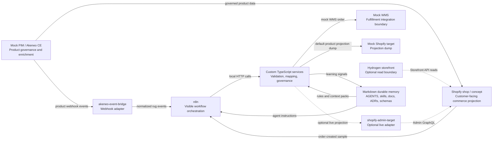

# Architecture Overview

## Purpose

This repository demonstrates how Context Architecture can govern agentic development in a commerce integration setting. It models enterprise decision boundaries with a small local system: mock PIM, optional local Akeneo CE, an Akeneo event bridge, Shopify-style order and product projection samples, optional Hydrogen storefront scope, n8n, custom services, schemas, ADRs, and review gates.

## Non-Goals

MVP v0.1 does not implement:

- Real Shopify credentials.
- Patchworks.
- Production Hydrogen or Oxygen deployment.
- Customer account or checkout behavior.
- Cloud Run deployment.
- Paperclip Teams.
- RAG.
- Akeneo as a default runtime dependency.

Live Shopify synchronization is optional dev-store infrastructure through [Shopify Live Sync](../commerce/shopify-live-sync.md), not a default runtime dependency. Hydrogen is optional storefront scope through [Hydrogen Storefront](../commerce/hydrogen-storefront.md), not a default Docker Compose service.

## Quality Goals

- Boundaries are visible enough for people and agents to reason about.
- Data contracts are testable through JSON Schemas and examples.
- Domain logic stays in TypeScript services, not n8n workflows.
- Local development stays Docker-based and credential-free by default.
- Cloud Run readiness is prepared without deploying.
- Durable memory remains curated and concise.

## Constraints

- Shopify is the customer-facing commerce projection, not the product master.
- Hydrogen is a customer-facing storefront read boundary, not a product projection writer.
- Akeneo/PIM is the product governance and enrichment source.
- n8n is a local visible workflow layer and iPaaS learning stand-in.
- Custom services own validation, mapping, idempotency direction, auditability direction, and failure behavior.
- High-risk product projection, storefront, fulfillment, customer data, Cloud Run, and governance changes require review gates.

## Solution Strategy

The lab uses a small set of independently understandable pieces:

- Markdown memory for principles, context, decisions, handoffs, and checklists.
- Repo-scoped Codex skills for bounded agent behavior.
- TypeScript/Fastify services for executable boundaries.
- Zod for runtime request validation in services.
- JSON Schema and Ajv for durable example validation.
- Vitest for service logic tests.
- Docker Compose for local orchestration.
- n8n workflow JSON for visible integration flow skeletons.
- Product export/projection contracts before real Akeneo Event Platform or Shopify integration.
- A local Akeneo webhook bridge before any production-like PIM event adapter.
- Hydrogen storefront scaffold before customer account, checkout, or deployment behavior.

## Context Boundary Summary

The diagram is intentionally conceptual. Patchworks and Cloud Run are future options. Akeneo CE, Shopify live sync, and Hydrogen are optional local/dev-store boundaries and not default MVP dependencies.
