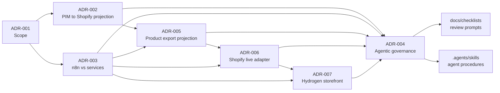

# Decisions Map

This page is a compact map of durable architecture decisions. The ADR files remain the source of truth.

| ADR | Decision | Protects |
| --- | --- | --- |
| [ADR-001](../decisions/ADR-001-project-scope.md) | MVP v0.1 excludes Paperclip Teams, RAG, Cloud Run deployment, and production Shopify sync; later ADRs add optional local/dev-store boundaries. | Keeps the lab focused on decision boundaries. |
| [ADR-002](../decisions/ADR-002-pim-shop-projection.md) | PIM/Akeneo is product master; Shopify is customer-facing projection. | Prevents Shopify from becoming the product governance source. |
| [ADR-003](../decisions/ADR-003-n8n-vs-custom-services.md) | n8n orchestrates visible workflows; tracked workflow JSON is the reviewable artifact; custom services own domain logic and validation. | Prevents workflows from becoming hidden business logic or unreviewable local state. |
| [ADR-004](../decisions/ADR-004-agentic-change-governance.md) | Agents may propose/implement bounded changes; high-risk changes require review gates. | Preserves accountability and decision rights. |
| [ADR-005](../decisions/ADR-005-product-export-projection-flow.md) | Akeneo CE enters as optional local setup through `akeneo-event-bridge`, n8n, product projection, and mock Shopify as first target. | Prevents real tools from silently replacing the model. |
| [ADR-006](../decisions/ADR-006-shopify-live-target-adapter.md) | Live Shopify sync is an optional `shopify-admin-target` adapter using private env credentials and archive-by-default removal. | Keeps Shopify API behavior and secrets behind an adapter boundary. |
| [ADR-007](../decisions/ADR-007-hydrogen-storefront-boundary.md) | Hydrogen is an optional storefront boundary that reads Shopify through Storefront API patterns and does not own Admin API writes. | Keeps customer-facing storefront work separate from product projection and credential handling. |

## Decision Flow

## When To Update ADRs

Update or add an ADR when a change alters:

- MVP scope.
- System ownership or source authority.
- Service responsibility boundaries.
- Deployment posture.
- Human review gates.
- Agent decision rights.

Small documentation clarifications usually belong in `docs/commerce`, `docs/context`, or `docs/overview` rather than a new ADR.

The n8n agent workflow lifecycle is governed by [ADR-003](../decisions/ADR-003-n8n-vs-custom-services.md) and summarized in [n8n as Integration Layer](../commerce/n8n-as-integration-layer.md).
