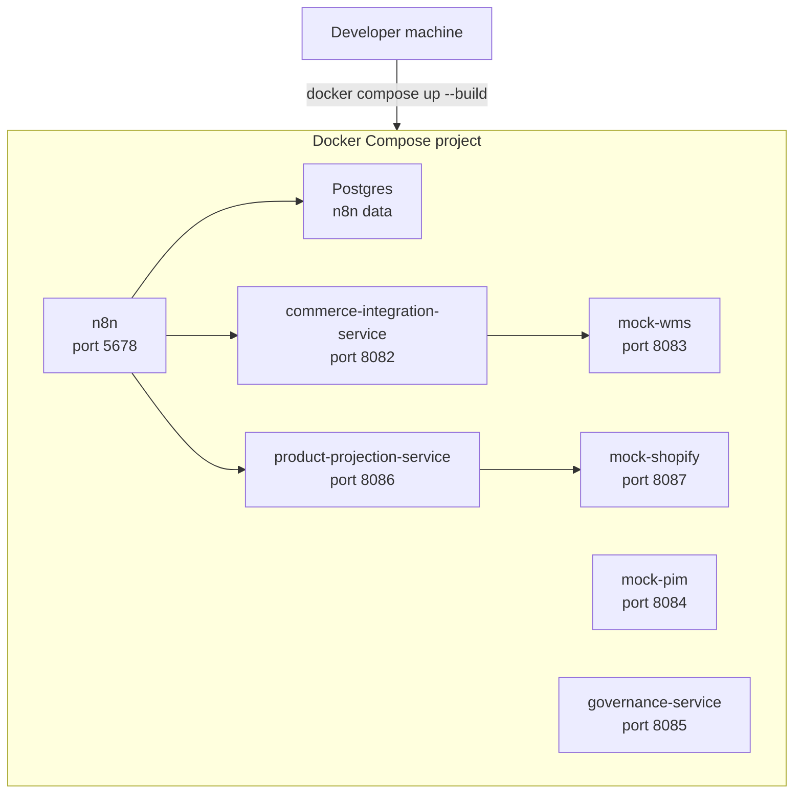

# Deployment View

## Local Deployment

MVP v0.1 runs locally through Docker Compose.

Each custom service has a service-specific Dockerfile and image default command. Compose does not need command overrides for those services.

## Cloud Run Readiness

Cloud Run deployment is not implemented. The readiness baseline is:

- Service-specific Dockerfiles.
- Production runtime dependencies.
- Non-root `node` runtime user.
- `process.env.PORT`.
- `0.0.0.0` binding.
- `GET /health`.
- No committed secrets.
- Environment-based runtime configuration.

Future deployment notes and TODOs live in [Cloud Run Notes](../deployment/cloud-run-notes.md).

## Optional Local Akeneo

Akeneo CE is introduced through [Akeneo Local Setup](../commerce/akeneo-local-setup.md) after [ADR-005](../decisions/ADR-005-product-export-projection-flow.md). The generated Akeneo app lives under ignored `.local/akeneo/pim/` and is managed by Akeneo’s generated Makefile. The tracked external-system boundary is [Akeneo Integration Boundary](../../integrations/akeneo/README.md).

It remains outside the default local startup:

- Default lab stack: `docker compose up --build`
- Optional Akeneo setup: `npm run akeneo:setup`
- Optional Akeneo start: `npm run akeneo:up`
- Optional Akeneo stop: `npm run akeneo:down`

The future mock Shopify projection target should start as a local service and stay credential-free.

## Optional Hydrogen

Hydrogen is introduced as optional storefront scope through [Hydrogen Storefront](../commerce/hydrogen-storefront.md) and [ADR-007](../decisions/ADR-007-hydrogen-storefront-boundary.md). It is not part of the default Docker Compose stack yet.

Future Hydrogen implementation must keep Storefront API tokens outside source control, avoid Shopify Admin API writes, and require review before Oxygen, self-hosted deployment, Customer Account API, checkout, or customer data behavior is added.

## Future Deployment Questions

- Which GCP project and region should own the lab deployment?
- Which Artifact Registry naming convention should be used?
- Which service-to-service authentication model should be used?
- Where should idempotency and audit records live?
- Should n8n remain local, be hosted separately, or be replaced for hosted workflows?
- Which secrets manager and runtime environment strategy should be used?

Do not execute deployment steps until a Cloud Run deployment task is explicitly requested and reviewed.
