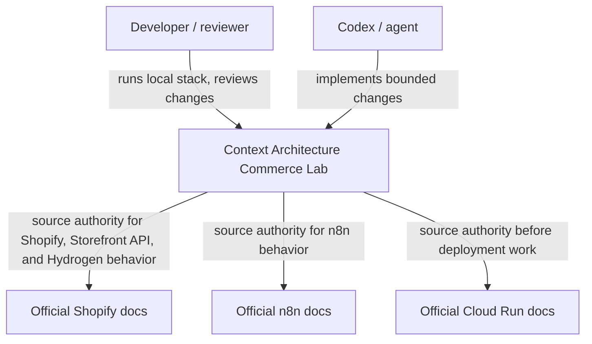
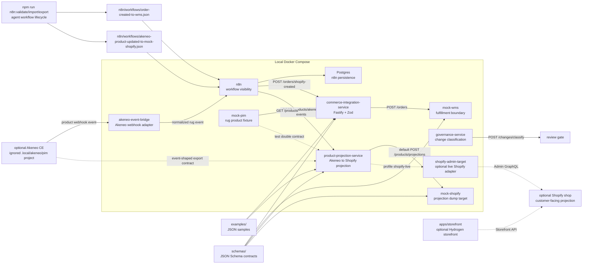
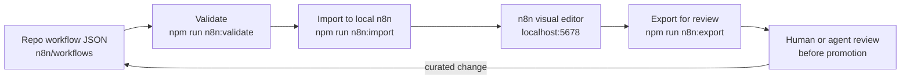
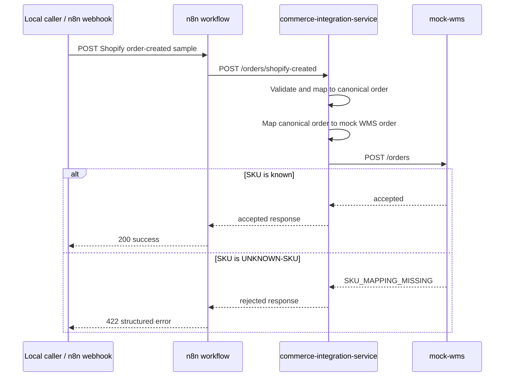
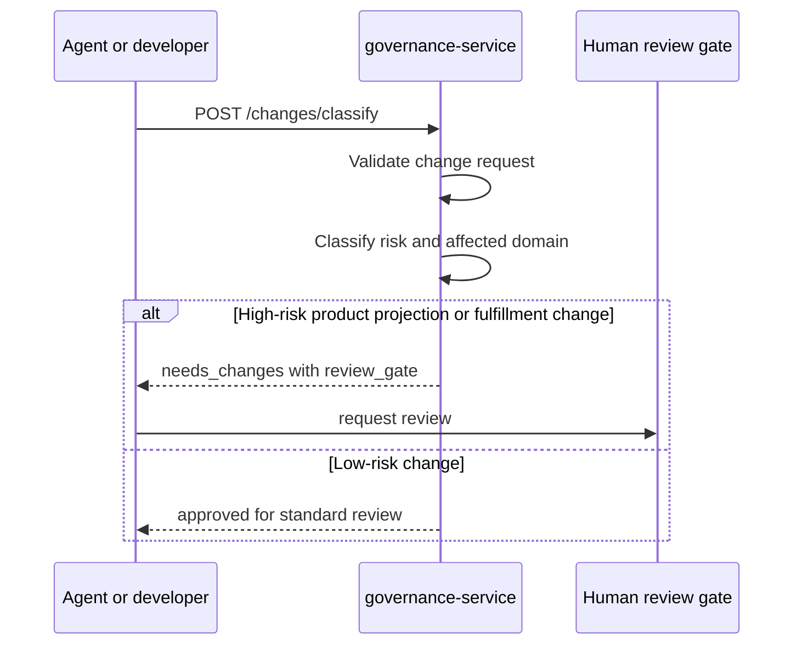
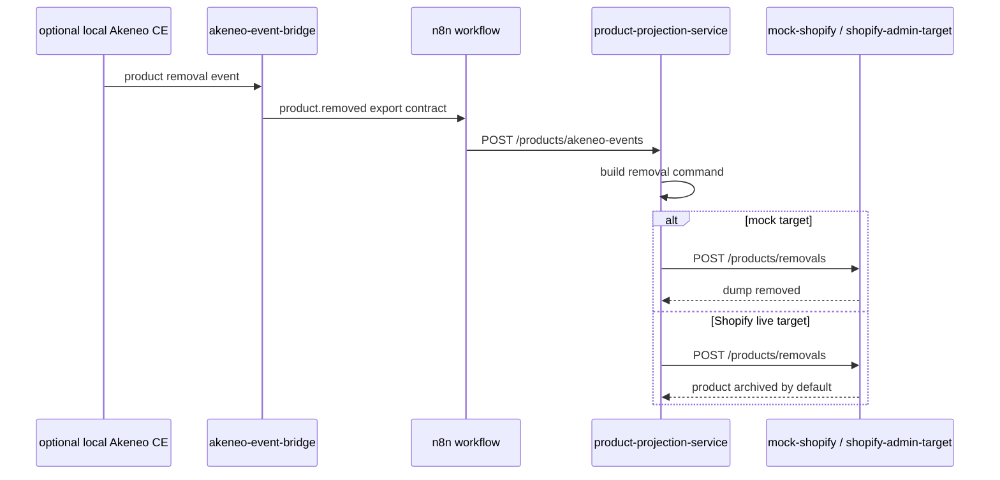
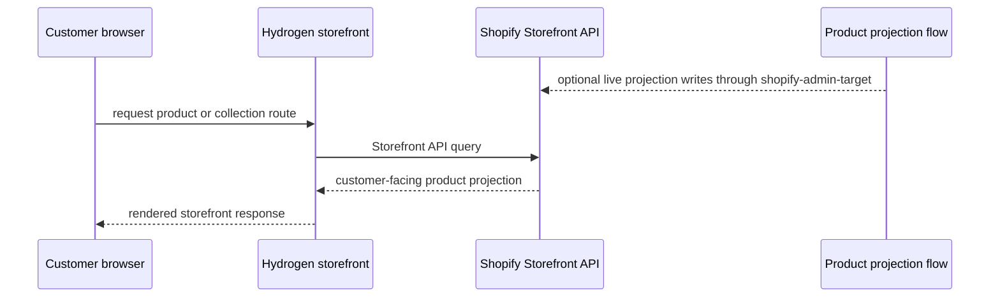

# Runtime And Containers

This page combines the first C4-style zooms for the MVP. Split it later if it becomes too dense.

## System Context



## Container View



## Service Responsibilities

| Service | Responsibility | Health | Dockerfile |
| --- | --- | --- | --- |
| `commerce-integration-service` | Validate Shopify order-created samples and map to canonical and mock WMS orders. | `GET /health` | `services/commerce-integration-service/Dockerfile` |
| `mock-wms` | Accept mock WMS orders unless SKU mapping is missing. | `GET /health` | `services/mock-wms/Dockerfile` |
| `mock-pim` | Return governed rug product fixture data. | `GET /health` | `services/mock-pim/Dockerfile` |
| `governance-service` | Classify change requests and return review gate decisions. | `GET /health` | `services/governance-service/Dockerfile` |
| `akeneo-event-bridge` | Normalize local Akeneo webhook envelopes to the product export contract and forward rug events to n8n. | `GET /health` | `services/akeneo-event-bridge/Dockerfile` |
| `product-projection-service` | Validate Akeneo exports and map governed PIM products to Shopify projection payloads. | `GET /health` | `services/product-projection-service/Dockerfile` |
| `mock-shopify` | Receive Shopify-style product projection dumps before real Shopify integration. | `GET /health` | `services/mock-shopify/Dockerfile` |
| `shopify-admin-target` | Optional live Shopify Admin GraphQL adapter for product projection upserts and removals. | `GET /health` | `services/shopify-admin-target/Dockerfile` |

Hydrogen is documented as an optional storefront boundary in [Hydrogen Storefront](../commerce/hydrogen-storefront.md). The scaffold lives under [apps/storefront](../../apps/storefront/) and is not part of the default Docker Compose stack.

## Workflow Lifecycle

Tracked workflow JSON in [n8n/workflows](../../n8n/workflows/) is the reviewable source artifact. The local n8n instance is a runner/editor, not durable memory.



See [ADR-003](../decisions/ADR-003-n8n-vs-custom-services.md) and [n8n as Integration Layer](../commerce/n8n-as-integration-layer.md) for the decision and operating rules.

## Runtime Flow: Order Created To WMS



## Runtime Flow: Governance Classification



## Runtime Flow: Product Export Projection

```mermaid
sequenceDiagram
  participant Akeneo as optional local Akeneo CE
  participant Bridge as akeneo-event-bridge
  participant N8N as n8n workflow
  participant Projection as product-projection-service
  participant Target as mock-shopify / shopify-admin-target
  participant Reviewer as Product projection review

  Akeneo->>Bridge: product webhook event
  Bridge->>Bridge: ignore non-rug events; normalize rug event
  Bridge->>N8N: repo product export contract
  N8N->>Projection: POST /products/akeneo-events
  Projection->>Projection: validate export and map projection
  alt product is approved and mapping exists
    Projection->>Target: Shopify projection payload
    Target-->>Projection: accepted target result
    Projection-->>N8N: accepted projection result
  else mapping or source authority is missing
    Projection-->>N8N: review_required
    N8N->>Reviewer: route for product projection review
  end
```

## Runtime Flow: Product Removal



## Runtime Flow: Hydrogen Storefront Read



## Notes

- n8n should remain orchestration and response routing, not durable domain logic.
- Service READMEs and source code own service detail.
- Schemas and examples own data-contract detail.
- ADRs own durable architecture decisions.
